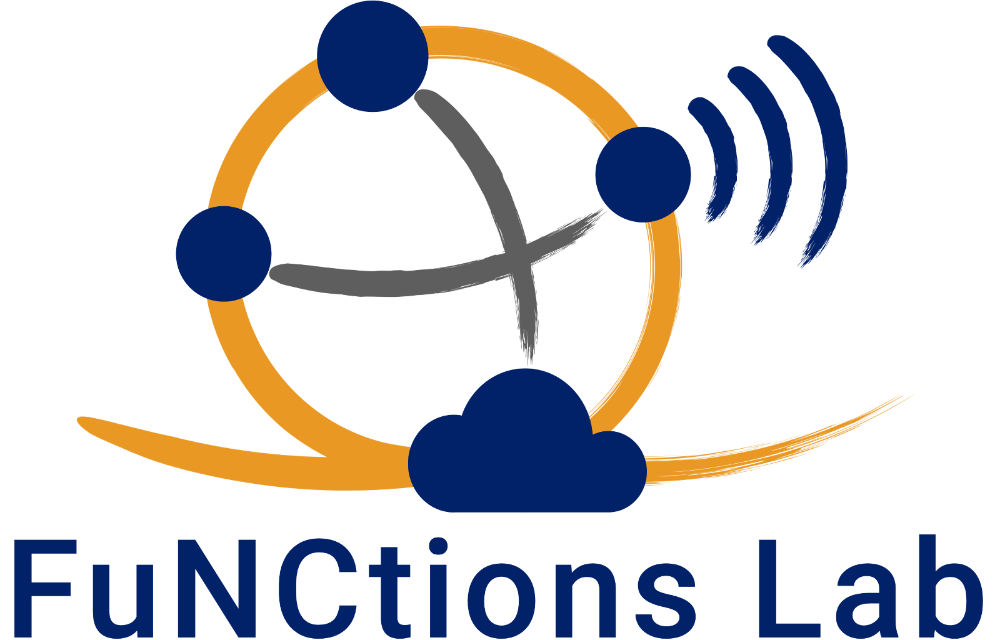

I am an assistant professor of [Electrical and Computer Engineering](https://ece.duke.edu/) and [Computer Science](https://cs.duke.edu/) (secondary appointment) at Duke University. I direct the 
,
working with a group of talented students on various topics cutting across the networking, communication, sensing, and energy-efficient computing aspects of wireless, mobile, optical, and quantum networked systems, and our projects span both the theoretical and experimental domains. I am also the co-founder and Network Lead of [WiLO Networks Inc.](https://www.wilonetworks.com/), a start-up focusing on low-power sensor hardware and end-to-end systems.

Before joining Duke in Fall 2021, I was a postdoc in the Department of Electrical Engineering at Yale University in 2020&ndash;2021, working with Prof. [Leandros Tassiulas](https://seas.yale.edu/faculty-research/faculty-directory/leandros-tassiulas) and Prof. [Lin Zhong](https://www.linzhong.org/). Before that, I received my Ph.D. degree in Electrical Engineering from Columbia University in 2020 (advisor: Prof. [Gil Zussman](https://wimnet.ee.columbia.edu/people/gil-zussman/)) and my B.Eng. degree in Electronic Engineering from Tsinghua University in 2014 (advisors: Prof. [Zhisheng Niu](https://network.ee.tsinghua.edu.cn/niulab/niu_zhisheng.php) and Prof. [Sheng Zhou](https://network.ee.tsinghua.edu.cn/shengzhou/)).

---

**Interests**: I am interested in the broad areas of future wireless, mobile, optical, and quantum networks as well as intelligent IoT systems. My recent research focuses on both theoretical and experimental aspects of massive antenna systems and millimeter-wave networks, optical and quantum networks, and spectrum sharing systems, and their convergence with edge cloud, energy-efficient computing, and AI/ML. I also enjoy building efficient hardware-software systems and experimental testbeds at scale.

**Impacts**: My research has been recognized by two IBM Academic Awards (2023, 2021), a Google Research Scholar Award (2021), the Columbia Engineering Morton B. Friedman Memorial Prize for Excellence (2021), the Columbia University Eli Jury Award (2021), a Facebook Fellowship (2019), and a Wei Family Private Foundation (WFPF) Fellowship (2014). I have received multiple paper awards from IEEE/Optica OFC’24 (Top-Scored Paper), IEEE/Optica OFC’23 (Top-Scored Paper), ECOC’23 (Best Paper Award), ACM CoNEXT’16 (Best Paper Award), ACM MobiHoc’19 (Best Paper Finalist), and IEEE MTT-S IMS’19 (Advanced Practice Paper Finalist). My Ph.D. thesis received the ACM SIGMOBILE Dissertation Award Runner-up. WiLO Networks Inc. is currently supported by NSF SBIR Phase I (TI-2108012) and Phase II (TI-2345381) awards.

---

> **I am always looking for motivated and creative B.S., M.S., Ph.D. students, and Postdocs to join my group in Duke ECE. If you are interested, please email me your CV, transcript, and a brief note about your research interests, and I would be happy to chat!**

---

###### **Ongoing Projects**:
* [**Duke DST Launch Seed**] The Duke Quantum Network
* [**NSF NewSpectrum**] Enabling Dense and In-situ Spectrum Monitoring via Circuits-system Co-design
* [**Duke Engineering BtH Initiative**] Lighting a Dark Fiber Network for Hybrid Quantum-Classical Experimental Research
* [**NSF EAGER**] An Integrated Fiber Sensing and Communication Living Lab in the Research Triangle
* [**SRC/DARPA JUMP 2.0**] Center for Ubiquitous Connectivity (CUbiC) [[CUbiC website](https://cubic.engineering.columbia.edu/)] [[center info](https://www.src.org/program/jump2/cubic/)]
* [**NSF SII-NRDZ**] Spectrum Sharing via Consumption Models and Telemetry in an Urban FCC Innovation Zone
* [**NSF CISE**] Medium: Softwarizing Millimeter-wave Radio Access Networks at the Edge 
* [**NSF SWIFT**] Spectrum Coexistence with Rapid Interferer Learning, Detection, and Mitigation
* [**NSF NAI**] National AI Institute for Edge Computing Leveraging Next-generation Networks [[Athena website](https://athena.duke.edu/)]
* [**NSF PAWR**] Cloud Enhanced Open Software-defined Mobile Wireless Testbed for City-scale Deployment [[COSMOS website](https://cosmos-lab.org/)]

###### **Past Projects**:
- [**NSF EARS**] FlexICoN: Full-duplex Wireless: From Integrated Circuits to Networks (Columbia) [[FlexICoN website](https://flexicon.ee.columbia.edu/)]
- [**NSF CISE**] EnHANTs: Energy-Harvesting Active Networked Tags (Columbia) [[EnHANTs website](https://enhants.ee.columbia.edu/)]

---

###### **Recent Talks**:
* [**Sept. 2024**] ``Scalable Wireless Digital Twins for High-delity RF Signal Mapping'', SpectrumX AI/ML Research Community Seminar.
* [**Aug. 2024**] [``Toward Intelligent and Efficient Optical Networks: Performance Modeling, Co-Existence, and Field Trials''](https://www.optica.org/events/webinar/2024/08_august/toward_intelligent_and_efficient_optical_networks_performance_modeling_co-existence_and_field_tri/), Optica Technical Group Webinar (Optical Communications Technical Group).
* More talks and videos see below...

    

        
        
Talk at the ACM SIGMOBILE community workshop

    

    

        
        
Overview of the COSMOS testbed at ACM MobiCom'20

    

    

        
        
My Ph.D. life at Columbia Enginering

    

    

        
        
Interviewed by WebsEdge Science

    

---

**Acknowledgments**: Our research projects are supported in part by NSF grants ECCS-2434131 (NewSpectrum), CNS-2330333 (EAGER), AST-2232458 (SII-NRDZ), CNS-2211944 (CISE Core), CNS-2128638 (SWIFT), and CNS-2112562 (NAI), the SRC-DARPA JUMP 2.0 program (CUbiC – Center for Ubiquitous Connectivity), a Pratt Engineering Beyond the Horizon Initiative grant, a Google Research Scholar Award, an IBM Academic Award, an NEC Labs America Research Gift, an NTT Research Grant, and an ACM SIGMOBILE Student Community Grant. The findings, positions, or opinions of our research projects do not necessarily represent the official policy of any of these organizations.

---